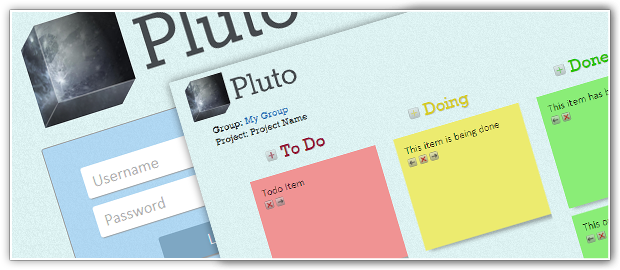

# Pluto Project Organizer

Pluto is a PHP-based project organizer which intends to help productivity, creating an environment for you to be able to manage your group's projects by creating a kanban chart (with fixed steps: to do, doing and done).

The database for the application is file-based, taking advantage of PHP's INI file parsing features.

## Requirements
* PHP 5

## Installation
Installing Pluto is simpler than ever! Just copy all the content of "src/" to your webserver and access your website. No setup required!
